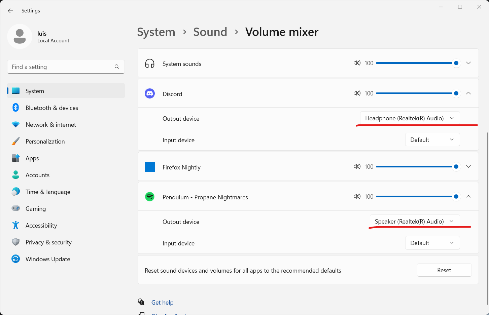
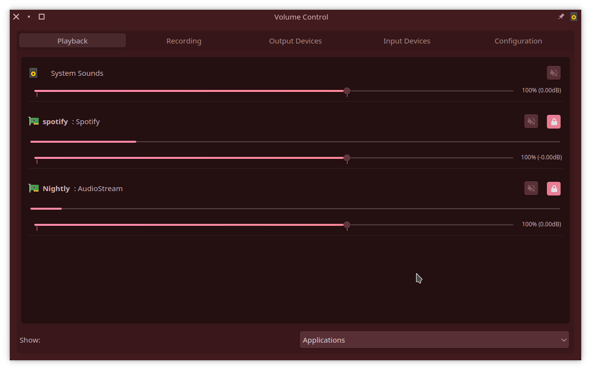
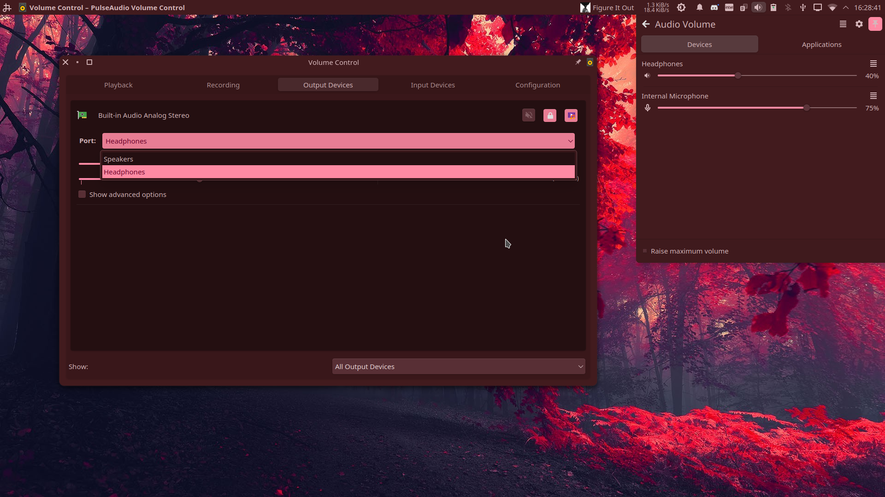
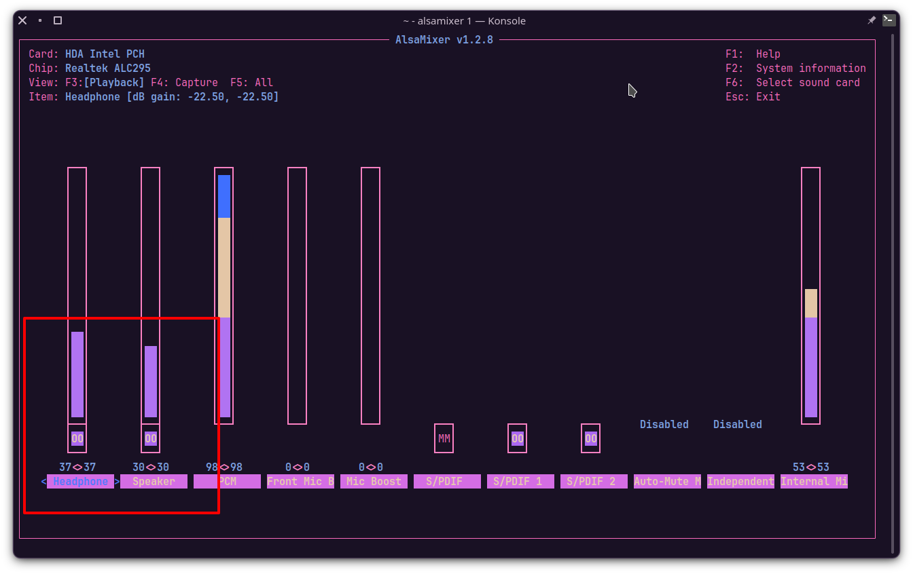

# [Guide] Splitting audio ports in Linux for simultaneous playback


## Introduction

On windows some laptops have the option to enable the playback of different audio streams on different audio outputs, for example you could listen to a video call in the browser through your wired headphones, while playing music from Spotify on the internal speakers.

Such option can have a different name depending on the sound card or laptop's vendor, for my laptop, an **HP Omen 15-dc100xxx with a ALC295 card** it is called _multistreaming_ and can be enabled from the **OMEN Audio Control** program.

Here's some screenshot showcasing that feature on Windows:


And this is how you route programs' audio to an individual output:



On Linux I don't have such an option, so can only listen one output at a time

That is:

- You have to unplug your wired speakers/headphones to be able to play anything from the internal speakers,
- And if you connect a wired speakers/headphones:
  - The internal speaker is muted, hidden from the gui and marked as unavailable

    

  - Audio streams are switched to your wired output without giving you the desired output option like windows does

    

## The final result

- Allow selecting and playing audio from the internal speakers while a wired output is connected
- Play different audio streams on each card port, simultaneously
- Have a separate audio sink for each output

 **Note:** The program used in above screenshots is `pavucontrol`

## Requirements

- PipeWire
- alsa-utils
- pavucontrol (optional)

## 1 Preparations, analyze how the card appears on Linux

### 1.1 Gather some information about the card

Run `pactl list cards` and save the output somewhere, bellow is a stripped
 version of mine to keep the important things

```yaml
Card #46
    Name: alsa_card.pci-0000_00_1f.3
    Driver: alsa
    Properties:
            api.alsa.path = "hw:0"
            device.product.id = "0xa348"
            device.vendor.id = "0x8086"
    ...
    Profiles:
            output:analog-stereo+input:analog-stereo: Analog Stereo Duplex (sinks: 1, sources: 1, priority: 6565, available: yes)
            output:analog-stereo: Analog Stereo Output (sinks: 1, sources: 0, priority: 6500, available: yes)
            input:analog-stereo: Analog Stereo Input (sinks: 0, sources: 1, priority: 65, available: yes)
            pro-audio: Pro Audio (sinks: 4, sources: 1, priority: 1, available: yes)
    Active Profile: output:analog-stereo+input:analog-stereo
    Ports:
            analog-output-speaker: Speakers (type: Speaker, priority: 10000, latency offset: 0 usec, availability group: Legacy 3, availability unknown)
                    Properties:
                            port.type = "speaker"
                            port.availability-group = "Legacy 3"
                            device.icon_name = "audio-speakers"
                            card.profile.port = "2"
                    Part of profile(s): output:analog-stereo, output:analog-stereo+input:analog-stereo
            analog-output-headphones: Headphones (type: Headphones, priority: 9900, latency offset: 0 usec, availability group: Legacy 4, availability unknown)
                    Properties:
                            port.type = "headphones"
                            port.availability-group = "Legacy 4"
                            device.icon_name = "audio-headphones"
                            card.profile.port = "3"
                    Part of profile(s): output:analog-stereo, output:analog-stereo+input:analog-stereo
```

Card details:

```yaml
Name: alsa_card.pci-0000_00_1f.3
Ports: analog-output-speaker analog-output-headphones
Profiles: output:analog-stereo input:analog-stereo output:analog-stereo+input:analog-stereo
device.product.id = "0xa348"
device.vendor.id = "0x8086"
```

As we can see, this laptop has three audio profiles, one for all audio outputs 
and other for all inputs, with an extra one that has both inputs and outputs (yours may vary)

### 1.2 Inspect the audio sinks available for our sound card

Run `pactl list sinks` and save the output, bellow is a stripped
version of mine to keep the important things

```yaml
Sink #47
    State: RUNNING
    Name: alsa_output.pci-0000_00_1f.3.analog-stereo
    Description: Built-in Audio Analog Stereo
    Driver: PipeWire
    ...
    Ports:
            analog-output-speaker: Speakers (type: Speaker, priority: 10000, availability group: Legacy 3, not available)
            analog-output-headphones: Headphones (type: Headphones, priority: 9900, availability group: Legacy 4, available)
    Active Port: analog-output-headphones
    Formats:
            pcm
```

Sink details:

```yaml
Name: alsa_output.pci-0000_00_1f.3.analog-stereo
Ports: analog-output-speaker analog-output-headphones
Active Port: analog-output-headphones
```

As we can see, there is only one audio sink that can play audio on the two outputs individually (yours may vary)

## 2 disable Headphone jack detection for speakers

1. First copy the folder `/usr/share/alsa-card-profile/mixer/paths/` to `/etc/alsa-card-profile/mixer/paths/`

    ```sh
    sudo cp -r /usr/share/alsa-card-profile/mixer/paths/ /etc/alsa-card-profile/mixer/paths/
    ```

2. Next we need to modify the mixer path in `/etc/alsa-card-profile/mixer/paths/` that matches the speakers port which in my case is `analog-output-speaker`.

    It is **crucial** to pick the correct one, to verify you did, change `description-key` value to something else (e.g. by removing the last letter) and restart pipewire (`systemctl restart --user pipewire pipewire-pulse pipewire.socket wireplumber`) the mixer path file name will show in pavucontrol or `pactl list sinks` instead of the actual port name:

    ```yaml
    Ports:
        analog-output-speaker: analog-output-speaker (type: Unknown, priority: 10000, availability group: Legacy 4, available)
    ```

3. Delete all the other files in `/etc/alsa-card-profile/mixer/paths/` leaving only your mixer path and the common file e.g:

    ```sh
    find /etc/alsa-card-profile/mixer/paths/ -type f ! -name 'analog-output-speaker.conf' ! -name 'analog-output.conf.common' -exec rm -f {} +
    ```

4. Change the `description-key` back to the default, then:

   - Set `state.plugged = unknown` inside the **Jack** section that best matches the wired port name of your card, in my case is `analog-output-headphones` so I use `[Jack Headphone]` one:

       ```ini
       [Jack Headphone]
       state.plugged = unknown
       state.unplugged = unknown
       ```

   - Comment (by adding semi-colon on start of line) the **Element** section that matches the port `[Jack ...]` in my case is `[Element Headphone]`:

       ```ini
       ; [Element Headphone]
       ; switch = off
       ; volume = off
       ```

5. Save the changes and restart the audio server by running:

    ```sh
    systemctl restart --user pipewire pipewire-pulse pipewire.socket wireplumber
    ```

    If everything went well you should have the speaker option available without having to unplug your wired device and

   - Should be able to play audio on them (individually)
   - Audio streams should still change automatically from speakers to your wired output and vice versa when plugging/unplugging a wired device

    

Good we're closer to our final goal, but you can stop here if this was your desired behavior...

## 3 Splitting for simultaneous playback with alsa firmware patch (for different applications on each port)

### 3.1 Analyze the card sub devices

First we need to identify and check if our card has more than one sub device and test if sound comes out of them

Run

```sh
aplay -l
```

You'll get something like the following

```ini
**** List of PLAYBACK Hardware Devices ****
card 0: PCH [HDA Intel PCH], device 0: ALC295 Analog [ALC295 Analog]
  Subdevices: 1/1
  Subdevice #0: subdevice #0
...
```

At this point, my card `card 0` (ALC295), has only one sub device, you may have more, take note of this information as we'll need it later

We can confirm the playback (output) and capture (input) streams the card currently has with `cat /proc/asound/pcm`

```yaml
00-00: ALC295 Analog : ALC295 Analog : playback 1 : capture 1
...
```

### 3.2 Making the alsa firmware patch file

#### Manually

Run

```sh
cat /proc/asound/card*/codec#* | grep -E 'Codec|Vendor Id|Subsystem Id|Address'
```

You'll get the codecs in the following format, pick the one that matches your card (mine is the `Realtek ALC295`):

```yaml
Codec: Realtek ALC295
Address: 0
Vendor Id: 0x10ec0295
Subsystem Id: 0x103c8575
...
```

With the above we can start creating our patch file:

1. Create the file (don't copy as is, modify according to explanation bellow):

    `/lib/firmware/hda-jack-retask.fw`

    ```ini
    [codec]
    0x10ec0295 0x103c8575 0

    [hints]
    indep_hp=yes
    vmaster=no
    ```

    Below `[codec]` line we should put the values of `vendor id`, the `subsystem id` and `address` of the card, separated by spaces.

    Below `[hints]` we need to add what is called hint strings

   - `indep_hp=yes` this will make for our jack output to be detected as an independent PCM stream with its own controls (meaning it will split away from internal speakers as a separate audio sink for us to play specific app stream on it).

   - `vmaster=no` will disable the virtual Master control so we can control volume on each port individually.

2. Create the following file:

    `/etc/modprobe.d/alsa-base.conf`

    ```sh
    options snd-hda-intel patch=hda-jack-retask.fw
    ```

#### Using hdajackretask

1. Run `hdajackretask`
2. In the Select a codec drop-down select your card
3. In the Options section check `Parser hints`
4. In the Hints list set `indep_hp` and `` to yes with double click on them.
5. Press `Install boot override`
6. Open the file `/lib/firmware/hda-jack-retask.fw` and add `vmaster=no` below `indep_hp=yes`

#### Using script and udev rule for immutable distros

For immutable distros `/lib/firmware/` is not writable. As a workaround you can use an udev rule that sets the hints on boot. **This method may cause some noises during boot and is not warranted to be as reliable as the firmware one, if that's the case, suggestions to improve it are welcome**

1. Create the file `/etc/udev/rules.d/91-pipewire-alsa-port-split.rules` (don't copy as is, modify according to explanation bellow)

    ```sh
    SUBSYSTEM!="sound", GOTO="pipewire_end"
    ACTION!="change", GOTO="pipewire_end"
    KERNEL!="card*", GOTO="pipewire_end"

    SUBSYSTEMS=="pci", ATTRS{vendor}=="0x8086", ATTRS{device}=="0xa348", \
    RUN+="/usr/local/bin/alsa-split-ports.sh"

    LABEL="pipewire_end"
    ```

2. Create the script `/usr/local/bin/alsa-split-ports-hints.sh` and set `CODEC` `VENDOR_ID` and `SUBSYSTEN_ID` with the ones from your card from `cat /proc/asound/card*/codec#* | grep -E 'Codec|Vendor Id|Subsystem Id|Address'`, note how the `CODEC` variable doesn't have the vendor name (`Realtek`) because whe are matching against `/sys/class/sound/hw*/chip_name`

   ```sh
    #!/usr/bin/env bash
    CODEC="ALC295"
    VENDOR_ID="0x10ec0295"
    SUBSYSTEN_ID="0x103c8575"
    HINTS="indep_hp = yes
    vmaster = no
    "

    get_codec_hwdep() {
        local codec=$1
        local vendor_id=$2
        local subsystem_id=$3
        local addr=""
        [[ -z "$codec" || -z "$vendor_id" || -z "$subsystem_id" ]] && { echo "ERROR: Not enough arguments given"; return; }
        for file in /sys/class/sound/hw*; do
            if [[ -n "$addr" ]]; then
            echo "$addr"
            return
            fi
            if grep -q "$codec" "$file/chip_name" && grep -q "$vendor_id" "$file/vendor_id" && grep -q "$subsystem_id" "$file/subsystem_id"; then
                addr=$file
            fi
        done
        if [[ -z "$addr" ]]; then
        echo "ERROR: Could not get address for c:$codec v:$vendor_id s:$subsystem_id"
        return
        fi
    }
    # get_codec_hwdep "$CODEC" "$VENDOR_ID" "$SUBSYSTEN_ID"
    hwdep="$(get_codec_hwdep "$CODEC" "$VENDOR_ID" "$SUBSYSTEN_ID")"

    if [[ "$hwdep" == *"ERROR"* || -z "$hwdep" ]]; then
    exit 1
    fi


    while IFS=$'\n' read -r line; do
    if [[ -z "$line" ]]; then
        continue
    fi
    echo "$line > ${hwdep}/hints"
    echo "$line" > "${hwdep}"/hints
    done <<< "$HINTS"

    echo "echo 1 > ${hwdep}/reconfig"
    echo 1 > "${hwdep}"/reconfig

    # wait some time to intialize before restoring
    sleep 5
    alsactl restore
   ```

#### Reboot to apply the changes

### 3.3 Verify that the patch works

Run again

```sh
aplay -l
```

You _should_ get something like the following

```ini
**** List of PLAYBACK Hardware Devices ****
card 0: PCH [HDA Intel PCH], device 0: ALC295 Analog [ALC295 Analog]
  Subdevices: 0/1
  Subdevice #0: subdevice #0
card 0: PCH [HDA Intel PCH], device 2: ALC295 Alt Analog [ALC295 Alt Analog]
  Subdevices: 1/1
  Subdevice #0: subdevice #0
```

Now the card ALC295 (`card 0`), has an extra sub device (`2`), interesting...

Run `cat /proc/asound/pcm`, if there is a new sub device and has a playback sub-stream (`playback 1`) like below you can continue

```yaml
00-00: ALC295 Analog : ALC295 Analog : playback 1 : capture 1
00-02: ALC295 Alt Analog : ALC295 Alt Analog : playback 1
...
```

#### 3.3.1 Identify what output each device corresponds to

1. Plug-in your wired audio device then run `alsamixer -c0` (replace 0 with your card #number if needed)
   1. Un-mute any muted device (the ones with MM below the volume slider) pressing `m`
   2. Increase their volume to around 30 if the're on 0
   3. Enable `Independent HP` if is not enabled
   4. Press `Esc` to exit.

   

2. Finally, save it by running

    ```sh
    sudo alsactl store --file /etc/asound.conf
    ```

3. Stop any running pipewire services (may need to stop it multiple times if it gets restarted):

    ```sh
    systemctl --user stop pipewire.service pipewire.socket pipewire-pulse.service pipewire-pulse.socket wireplumber.service
    ```

4. Run `speaker-test -Dhw:0,0 -c2` (replace 0,0 with the card #number and device #numbers from your card from `aplay -l`)

    For the device 0 (speaker-test -Dhw:0,0 -c2) the sound comes out from the speakers, so `device 0` is the speakers

5. Repeat for all the devices for your card and note which device corresponds to which physical output

So my card's outputs are the following (yours may vary):

- Device `0,0` (card 0, device 0) handles Speakers (and also microphones, as we saw in `cat /proc/asound/pcm`)
- Device `0,2` (card 0, device 2) handles Headphones

## 4 Making a custom alsa profile for our card

### 4.1 Now is time to do a recap of all information we have captured

Card details:

```yaml
Name: alsa_card.pci-0000_00_1f.3
Ports: analog-output-speaker analog-output-headphones
Profiles: output:analog-stereo input:analog-stereo output:analog-stereo+input:analog-stereo
```

Sink details:

```yaml
Name: alsa_output.pci-0000_00_1f.3.analog-stereo
Ports: analog-output-speaker analog-output-headphones
Active Port: analog-output-headphones
```

Card sub devices and playback (outputs) / capture (inputs) location:

```ini
**** List of PLAYBACK Hardware Devices ****
card 0: PCH [HDA Intel PCH], device 0: ALC295 Analog [ALC295 Analog]
  Subdevices: 0/1
  Subdevice #0: subdevice #0
card 0: PCH [HDA Intel PCH], device 2: ALC295 Alt Analog [ALC295 Alt Analog]
  Subdevices: 1/1
  Subdevice #0: subdevice #0
```

```yaml
00-00: ALC295 Analog : ALC295 Analog : playback 1 : capture 1
00-02: ALC295 Alt Analog : ALC295 Alt Analog : playback 1
...
```

So in my case I have:

- Two ports: `analog-output-speaker analog-output-headphones`
- Device locations for the card 0 correspond to:
  - Device `0,0` (card 0, device 0) Speakers (also handles microphones)
  - Device `0,2` (card 0, device 2) Headphones

### 4.2 Create the profile

Rename your mixer path file from [2 disable Headphone jack detection for speakers](#2-disable-headphone-jack-detection-for-speakers) like below:

```sh
sudo cp /etc/alsa-card-profile/mixer/paths/analog-output-speaker.conf /etc/alsa-card-profile/mixer/paths/analog-output-speaker-split.conf
```

Now create the file `/etc/alsa-card-profile/mixer/profile-sets/split-ports-profile.conf` and adapt it to your system according to the comments

```ini
; This will let alsa generate automatic profiles (e.g internal speaker + microphone)
[General]
auto-profiles = yes


; device-strings describes the ALSA device string(s) that PulseAudio uses to open the device, where "%f" specifies the card number (should always be present in the string).

; This is the mapping for the internal speaker
; If needed, change the 0 in "hw:%f,0" to your sub device location
; You can change the description for this and other mappings if you want
; in paths output put the name of the previously created custom mixer path
[Mapping analog-stereo-speaker]
description = Speakers
device-strings = hw:%f,0
paths-output = analog-output-speaker-split
channel-map = left,right
direction = output

; This is the mapping for the jack output (headphones)
; If needed, change the 2 in "hw:%f,2" to your sub device location
; in paths output put the name of the from card details
[Mapping analog-stereo-headphones]
description = Headphones
device-strings = hw:%f,2
paths-output = analog-output-headphones
channel-map = left,right
direction = output


; This is the mapping that will handle internal and external microphones, as you could see in `cat /proc/asound/pcm`, the card also had a capture port
; in the 0,0 sub device location so let's add it here too (change the 0 in "hw:%f,0" to your sub device location that has the capture port)
; All the paths-input names here came from the default.conf profile set and you may have to adapt it if your input port name is not included

[Mapping analog-stereo-input]
description = Microphone
device-strings = hw:%f,0
channel-map = left,right
paths-input = analog-input-front-mic analog-input-rear-mic analog-input-internal-mic analog-input-dock-mic analog-input analog-input-mic analog-input-linein analog-input-aux analog-input-video analog-input-tvtuner analog-input-fm analog-input-mic-line analog-input-headphone-mic analog-input-headset-mic
direction = input


; Broken in parts the profile name means to join
; The name of the Mapping containing the analog-output-headphones (output:analog-stereo-headphones)
; The name of the Mapping containing the analog-output-speaker (output:analog-stereo-speaker)
; The name of the Mapping containing the analog-stereo-input (input:analog-stereo-input)

; in output-mappings put the name of the output mappings
; input-mappings put the name of the input mappings

; NOTE: Not to be confused width the paths-output/paths-input inside the mapping, we're not using those directly

; This is the profile that will have the internal speakers + jack output + all microphones
; in paths output put the name of the from card details
[Profile output:analog-stereo-headphones+output:analog-stereo-speaker+input:analog-stereo-input]
description = Analog Stereo Duplex
output-mappings = analog-stereo-headphones analog-stereo-speaker
input-mappings = analog-stereo-input
priority = 80

; This profile will have the internal speakers + jack output, but not microphones
[Profile output:analog-stereo-headphones+output:analog-stereo-speaker]
description = Analog Stereo Outputs Only
output-mappings = analog-stereo-headphones analog-stereo-speaker
priority = 70
```

### 4.3 Link the profile to the card

1. Create the file `/etc/udev/rules.d/91-pipewire-alsa-port-split.rules` (don't copy as is, modify according to explanation bellow). Also, if using the udev rule to apply hints from [Using script and udev rule for immutable distros](#using-script-and-udev-rule-for-immutable-distros) you can use the commented rule instead.

    ```sh
    SUBSYSTEM!="sound", GOTO="pipewire_end"
    ACTION!="change", GOTO="pipewire_end"
    KERNEL!="card*", GOTO="pipewire_end"

    SUBSYSTEMS=="pci", ATTRS{vendor}=="0x8086", ATTRS{device}=="0xa348", \
    ENV{ACP_PROFILE_SET}="split-ports-profile.conf"

    # SUBSYSTEMS=="pci", ATTRS{vendor}=="0x8086", ATTRS{device}=="0xa348", \
    # ENV{ACP_PROFILE_SET}="split-ports-profile.conf" \
    # RUN+="/usr/local/bin/alsa-split-ports.sh"

    LABEL="pipewire_end"
    ```

2. Replace the vendor and device id with `device.vendor.id` and `device.product.id` respectively, that you got in [1.1 Gather some information about the card](#11-gather-some-information-about-the-card)

3. **Reboot to apply the changes**

### 5 Verify the split worked

Run

```sh
pactl list sinks | grep -E 'Name|Desc|State|Port
```

I everything went well you should have a separate audio sink for each output:

```yaml
State: RUNNING
Name: alsa_output.pci-0000_00_1f.3.analog-stereo-headphone
Description: Built-in Audio Headphones
Ports:
Active Port: analog-output-headphones
State: IDLE
Name: alsa_output.pci-0000_00_1f.3.analog-stereo-speaker
Description: Built-in Audio Speakers
Ports:
Active Port: analog-output-speaker
```

## Credits & Resources

- Docs
  - [Linux Kernel Sound Subsystem Documentation](https://www.kernel.org/doc/html/v6.7/sound/)
    - [More Notes on HD-Audio Driver](https://www.kernel.org/doc/html/v6.7/sound/hd-audio/notes.html)
    - [Proc Files of ALSA Drivers](https://www.kernel.org/doc/html/v6.7/sound/designs/procfile.html)
  - [ALSA Documentation](https://www.alsa-project.org/wiki/Documentation)

[How to output unique audio to multiple ports/profiles of a PulseAudio card?](https://unix.stackexchange.com/questions/401492/how-to-output-unique-audio-to-multiple-ports-profiles-of-a-pulseaudio-card)
